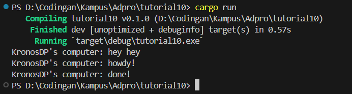
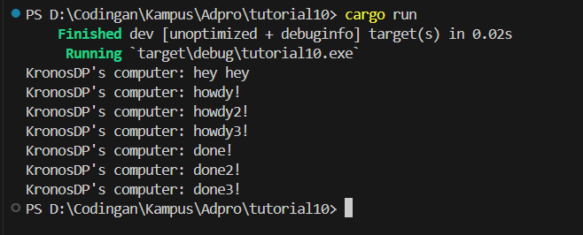

# Understanding how it works

Notice that hey hey came first. Notice. We can easily understand this because `executor.run()` prints out our howdy and done. Notice that above executor.run exists hey hey. That is why we print hey hey first, then howdy and done. ALso, notice that the method that encapsulates howdy and done have async.

# Multiple Spawn and removing drop

Remember `async`? This is what's happening. Notice that after howdy, we are using timer to wait. In the meantime, other task are being run. Here's what's happening: howdy is first being printed, then it waits to print done. Notice that howdy2 and howdy 3 is `async` right? So we print (do that job) that too and the done, done2, and done3 waits until the timer runs out.
